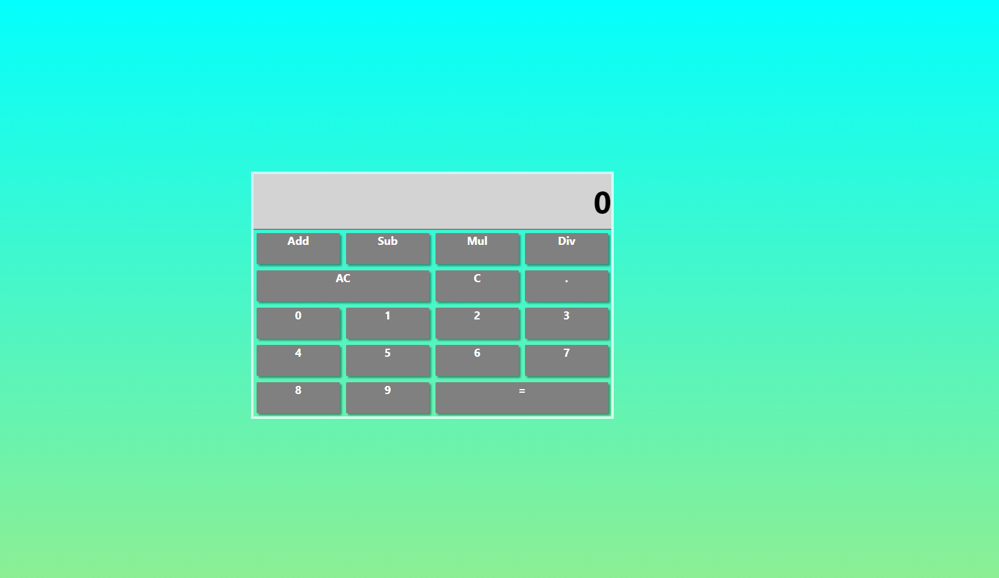

# Calculator

This is calculator app built using React, React Hooks, Styled Components. 
I tried to follow the react composition pattern.

## Info

The Calculator app has the usual functions and alongwith that the AC(All Clear) and C (Delete).

## Screenshot

## Live

https://calculator-two-alpha.vercel.app/